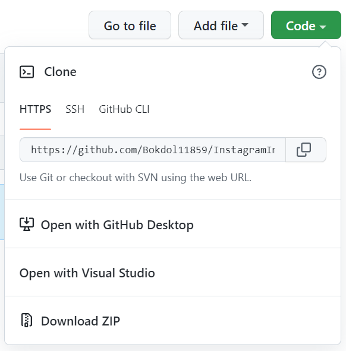

# Instagram Image Scraper
 
Instagram Image Scraper (IIS) is a program created to save public images of an Instagram account. 

It helps save images posted in a chosen Instagram account. 

IIS is built with Python, Selenium, and BeautifulSoup4.

 
## Installation
 

1. Download ZIP
2. Download appropriate ChromeDriver that matches your Chrome version and move it to the root folder
3. Open instagramCrawl.py with any editor or IDE and run it
4. Enter the information requested to start Scraping!

Use It At Your Own Risk!
 
## Usage
 
IIS scrapes the main images (first image if there's multiple) of the posts of a public Instagram account.

## Contributing
 
1. Fork it!
2. Create your feature branch: `git checkout -b my-new-feature`
3. Commit your changes: `git commit -am 'Add some feature'`
4. Push to the branch: `git push origin my-new-feature`
5. Submit a pull request :D
 
## History
 
Version 0.0.1 (2022-05-19) - Project Launch
 
## Credits
 
Developer - Eric Park (Bokdol11859)
 
## License
 
The MIT License (MIT)

Copyright (c) 2022 Eric Park

Permission is hereby granted, free of charge, to any person obtaining a copy of this software and associated documentation files (the "Software"), to deal in the Software without restriction, including without limitation the rights to use, copy, modify, merge, publish, distribute, sublicense, and/or sell copies of the Software, and to permit persons to whom the Software is furnished to do so, subject to the following conditions:

The above copyright notice and this permission notice shall be included in all copies or substantial portions of the Software.

THE SOFTWARE IS PROVIDED "AS IS", WITHOUT WARRANTY OF ANY KIND, EXPRESS OR IMPLIED, INCLUDING BUT NOT LIMITED TO THE WARRANTIES OF MERCHANTABILITY, FITNESS FOR A PARTICULAR PURPOSE AND NONINFRINGEMENT. IN NO EVENT SHALL THE AUTHORS OR COPYRIGHT HOLDERS BE LIABLE FOR ANY CLAIM, DAMAGES OR OTHER LIABILITY, WHETHER IN AN ACTION OF CONTRACT, TORT OR OTHERWISE, ARISING FROM, OUT OF OR IN CONNECTION WITH THE SOFTWARE OR THE USE OR OTHER DEALINGS IN THE SOFTWARE.
